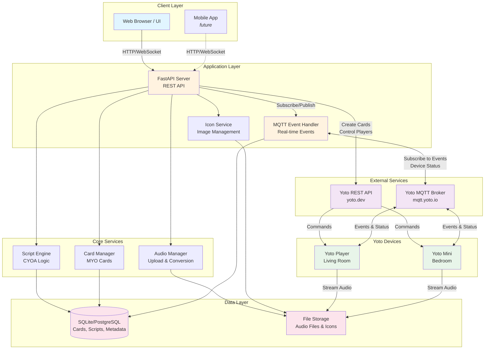
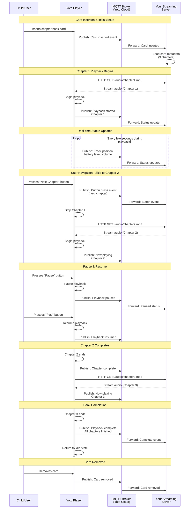

# Yoto Smart Stream

[](./docs/TESTING_GUIDE.md)
[](./docs/TESTING_GUIDE.md)
[](https://www.python.org/)
[](./LICENSE)

A service to stream audio to Yoto devices, monitor events via MQTT, and manage interactive audio experiences with a web UI. Includes support for "Choose Your Own Adventure" style interactive stories.

**Status**: ✅ Production server implemented and ready for deployment! ([See Details](PRODUCTION_SERVER_COMPLETE.md))

## 🚀 Quick Start

**New to streaming from your own service?** Check out our **[Quick Start: Streaming Guide](QUICKSTART_STREAMING.md)** to get up and running in 10 minutes!

For general project setup: See our **[Quick Start Guide](docs/QUICK_START.md)**

## 🎯 Features

- **Audio Streaming**: Stream custom audio content to Yoto players
- **Real-time Monitoring**: Track player events via MQTT (play/pause, button presses, battery status)
- **Interactive Cards**: Create Choose Your Own Adventure style experiences using physical button controls
- **Web UI**: Manage your audio library, configure cards, and write interactive scripts
- **Card Management**: Upload, organize, and configure custom Yoto cards
- **Multi-format Support**: Automatic audio conversion to Yoto-compatible formats
- **Automatic Token Refresh**: Background task keeps OAuth tokens valid indefinitely ([details](docs/OAUTH_TOKEN_PERSISTENCE.md))

## 🏗️ Architecture



### Key Components

- **FastAPI Server**: REST API for managing cards, audio, and device control
- **MQTT Handler**: Real-time event processing from Yoto devices (button presses, playback status)
- **Icon Service**: Manages 16x16 display icons for Yoto Mini devices
- **Audio Manager**: Handles file uploads, format conversion, and streaming
- **Script Engine**: Executes interactive "Choose Your Own Adventure" logic
- **Card Manager**: Creates and manages Yoto MYO (Make Your Own) cards

### Data Flow

1. **User → Web UI → API**: Manage cards, upload audio, configure scripts
2. **API → Yoto API**: Create cards, control playback, send commands
3. **Yoto Devices → MQTT**: Real-time events (button presses, status updates)
4. **MQTT → Event Handler → API → Web UI**: Real-time updates displayed to users
5. **Yoto Devices → File Storage**: Stream audio content directly from your server

For detailed architecture information, see [Architecture Documentation](docs/ARCHITECTURE.md).

## 📖 Chapter Book User Flow (Yoto Player Perspective)

This diagram illustrates how a Yoto player interacts with a straightforward chapter book card streaming from your own service:



**Key Points:**
- **Player-Initiated Streaming**: The Yoto player directly requests audio from your server via HTTP
- **MQTT for Events**: All user interactions and status updates flow through Yoto's MQTT broker
- **Sequential Chapters**: Chapters play in order and can be navigated using physical buttons
- **Real-time Monitoring**: Your server receives live updates about playback state, position, and battery
- **Simple HTTP**: Audio streaming uses standard HTTP GET requests - no special protocols needed

For interactive (Choose Your Own Adventure) stories where chapter selection depends on button choices, see the [Interactive Cards section](#-interactive-cards-choose-your-own-adventure).

## 📋 Prerequisites

- Python 3.9 or higher
- A Yoto player and Yoto account
- Yoto API client ID (get from [yoto.dev](https://yoto.dev/get-started/start-here/))

## 🚀 Quick Start

### 1. Clone the Repository

```bash
git clone https://github.com/earchibald/yoto-smart-stream.git
cd yoto-smart-stream
```

### 2. Set Up Environment

```bash
# Copy environment template
cp .env.example .env

# Edit .env and add your Yoto client ID
# YOTO_CLIENT_ID=your_client_id_here
```

### 3. Install Dependencies

```bash
# Create virtual environment
python -m venv venv
source venv/bin/activate  # On Windows: venv\Scripts\activate

# Install dependencies
pip install -r requirements.txt
```

### 4. Authenticate with Yoto API

```bash
# Run the simple client example to authenticate
python examples/simple_client.py
```

Follow the prompts to authenticate. Your refresh token will be saved for future use.

### 5. Start the Production Server

```bash
# Run the production server (recommended)
python -m yoto_smart_stream

# Or use uvicorn directly
uvicorn yoto_smart_stream.api:app --reload --port 8080

# Or run the example server (for learning/testing)
python examples/basic_server.py
```

Visit http://localhost:8080/docs for interactive API documentation.

## 📚 Documentation

### Quick Start & Testing
- **[Quick Start Guide](docs/QUICK_START.md)**: Get up and running in 10 minutes - from installation to working API
- **[Production Server Guide](PRODUCTION_SERVER_COMPLETE.md)**: Complete guide to the production server implementation
- **[Migration Guide](MIGRATION_GUIDE_EXAMPLES_TO_PROD.md)**: Migrate from examples to production server
- **[Testing Guide](docs/TESTING_GUIDE.md)**: Comprehensive testing instructions, coverage reports, and quality checks
- **[Railway Deployment Guide](docs/RAILWAY_DEPLOYMENT.md)**: Deploy to Railway.app with automated CI/CD
- **[Railway PR Environments](docs/RAILWAY_PR_ENVIRONMENTS_NATIVE.md)**: Automatic ephemeral environments for pull requests
- **[Validating PR Environments](docs/VALIDATING_PR_ENVIRONMENTS.md)**: How to validate Railway PR environments are working correctly (NEW)
- **[Railway Shared Development](docs/RAILWAY_SHARED_DEVELOPMENT.md)**: Coordinated access to shared dev environment
- **[Railway Token Setup](docs/RAILWAY_TOKEN_SETUP.md)**: Configure separate tokens per environment
- **[Codespaces Railway Setup](docs/CODESPACES_RAILWAY_SETUP.md)**: Configure Railway access for GitHub Codespaces
- **[Copilot Workspace Configuration](docs/COPILOT_WORKSPACE_NETWORK_CONFIG.md)**: Network access and Railway MCP server for GitHub Copilot Workspace (NEW)

### Creating Content
- **[Streaming from Your Own Service](docs/STREAMING_FROM_OWN_SERVICE.md)**: Stream audio from your server (NEW - recommended approach)
- **[Creating MYO Cards](docs/CREATING_MYO_CARDS.md)**: Traditional approach - upload audio to Yoto's servers
- **[Icon Management Guide](docs/ICON_MANAGEMENT.md)**: Working with display icons for Yoto Mini

### API & Implementation
- **[Yoto API Reference](docs/YOTO_API_REFERENCE.md)**: Complete API specification with endpoints, MQTT topics, and code examples
- **[Yoto MQTT Reference](docs/yoto-mqtt-reference.md)**: Deep dive into MQTT event service implementation and real-time communication

### Architecture & Planning
- **[Architecture Guide](docs/ARCHITECTURE.md)**: System design and implementation recommendations
- **[Planning Questions](docs/PLANNING_QUESTIONS.md)**: Open questions and decision points
- **[Getting Started Guide](docs/GETTING_STARTED.md)**: Step-by-step setup instructions
- **[AgentSkill](/.github/agentskills/yoto-api-development.md)**: Comprehensive development guide for Yoto API

## 🛠️ Development

### Using GitHub Codespaces

This project is configured for GitHub Codespaces with a complete development environment:

1. Click "Code" → "Create codespace on main"
2. Wait for the environment to set up automatically
3. Start developing!

**Note:** GitHub Copilot Workspace has network access configured to test Railway deployments directly. See [Copilot Workspace Network Configuration](docs/COPILOT_WORKSPACE_NETWORK_CONFIG.md) for details.

### Local Development

```bash
# Install development dependencies
pip install -r requirements-dev.txt

# Install pre-commit hooks
pre-commit install

# Run tests
pytest

# Run linter
ruff check .

# Format code
black .
```

## ☁️ Deployment

### Railway.app

Deploy to Railway with automated CI/CD and environment-specific tokens:

```bash
# Staging: Automatic on push to develop branch
git push origin develop

# Development: Manual with coordination
# Via GitHub Actions: Railway Development (Shared Environment) workflow

# Pull Requests: Automatic via Railway native PR Environments
# Open a PR → Railway creates pr-{number} environment automatically
```

**Persistent Storage**: Railway volumes are configured to persist Yoto OAuth tokens across deployments and restarts. Tokens are stored in `/data/.yoto_refresh_token` on Railway, ensuring authentication survives instance restarts.

**PR Environments**: Railway automatically creates ephemeral environments for pull requests with zero configuration. See [Railway PR Environments Guide](docs/RAILWAY_PR_ENVIRONMENTS_NATIVE.md).

**Static Environments**: Uses pre-registered callback URLs for Yoto OAuth compatibility.

**Token Security**: Production uses a single Railway token (`RAILWAY_TOKEN_PROD`). Application secrets like `YOTO_CLIENT_ID` are stored as Railway Shared Variables. See [GitHub Secrets Setup](GITHUB_SECRETS_SETUP.md).

**Status**: 
- ✅ Production (main branch) - Auto-deployed with `RAILWAY_TOKEN_PROD`
- ✅ PR Environments (all PRs) - Auto-created by Railway native feature, inherits secrets via Shared Variables

**Resources**:
- **[GitHub Secrets Setup](GITHUB_SECRETS_SETUP.md)** - Configure deployment secrets
- **[PR Environments Guide](docs/RAILWAY_PR_ENVIRONMENTS_NATIVE.md)** - Automatic PR deployments
- **[Deployment Guide](docs/RAILWAY_DEPLOYMENT.md)** - Complete setup and deployment instructions
- **[Quick Reference](docs/RAILWAY_QUICK_REF.md)** - Common deployment commands

### Health Check

All deployments include a health check endpoint:
```bash
curl https://your-app.up.railway.app/health
```

## 📖 Examples

### Basic Player Control

```python
from yoto_api import YotoManager

# Initialize and authenticate
ym = YotoManager(client_id="your_client_id")
ym.set_refresh_token("your_refresh_token")
ym.check_and_refresh_token()

# Get players
ym.update_player_status()
for player_id, player in ym.players.items():
    print(f"{player.name}: {'Online' if player.online else 'Offline'}")

# Control a player
ym.pause_player(player_id)
ym.play_player(player_id)
ym.set_volume(player_id, 10)
```

### Listen to MQTT Events

```bash
python examples/mqtt_listener.py
```

### Start API Server

```bash
python examples/basic_server.py
```

Then use the API:
```bash
# List players
curl http://localhost:8080/api/players

# Control a player
curl -X POST http://localhost:8080/api/players/{player_id}/control \
  -H "Content-Type: application/json" \
  -d '{"action": "pause"}'
```

## 🎨 Creating Custom MYO Cards

Create your own custom audio cards for Yoto players with two approaches:

### Option 1: Stream from Your Own Service (Recommended)

Point cards to your own streaming URL for complete control:

```python
# Create card that streams from your server
card_data = {
    "title": "My Streaming Story",
    "content": {
        "chapters": [{
            "tracks": [{
                "url": "https://your-server.com/audio/story.mp3"  # YOUR server!
            }]
        }]
    }
}
```

**Benefits:**
- ✅ Update audio without recreating cards
- ✅ Dynamic content (time-based, personalized, etc.)
- ✅ No file size limits
- ✅ Complete control over content

**Quick Start:** See [Streaming from Your Own Service](docs/STREAMING_FROM_OWN_SERVICE.md)

### Option 2: Upload to Yoto's Servers (Traditional)

Upload audio files to Yoto's storage:

```python
from yoto_api import YotoManager

# Authenticate
ym = YotoManager(client_id="your_client_id")
ym.set_refresh_token("your_refresh_token")

# Create a custom card with your audio
# 1. Calculate file hash
# 2. Get upload URL
# 3. Upload audio file
# 4. Create card with metadata
# 5. Play on device
```

**Complete Guide:** See [Creating MYO Cards](docs/CREATING_MYO_CARDS.md) for detailed instructions including:
- Audio file preparation and upload
- Cover image creation
- Multi-chapter card creation
- Complete Python code examples
- Troubleshooting tips

## 🎮 Interactive Cards (Choose Your Own Adventure)

Create interactive stories that respond to button presses:

```json
{
  "card_id": "adventure-001",
  "chapters": {
    "1": {
      "audio_file_id": "intro.mp3",
      "choices": {
        "left": {"next_chapter": 2},
        "right": {"next_chapter": 3}
      }
    },
    "2": {
      "audio_file_id": "left-path.mp3",
      "choices": {
        "left": {"next_chapter": 4},
        "right": {"next_chapter": 5}
      }
    }
  }
}
```

See [Architecture Guide](docs/ARCHITECTURE.md) for detailed implementation.

## 🏗️ Project Structure

```
yoto-smart-stream/
├── .devcontainer/          # GitHub Codespaces configuration
├── .github/
│   └── agentskills/       # Development guides
├── docs/                  # Documentation
├── examples/              # Example scripts
│   ├── simple_client.py   # Basic API usage
│   ├── mqtt_listener.py   # Event monitoring
│   └── basic_server.py    # FastAPI server
├── yoto_smart_stream/     # Main package (to be implemented)
├── tests/                 # Test suite
├── pyproject.toml         # Project configuration
├── requirements.txt       # Dependencies
└── README.md             # This file
```

## 🤝 Contributing

Contributions are welcome! Please read our contributing guidelines before submitting PRs.

1. Fork the repository
2. Create a feature branch
3. Make your changes
4. Run tests and linting
5. Submit a pull request

### Keeping Documentation Up to Date

When making significant architectural changes:

1. **Update the Architecture Diagram**: Edit the Mermaid diagram in `README.md` (🏗️ Architecture section)
2. **Update Architecture Docs**: Sync changes with `docs/ARCHITECTURE.md` for detailed explanations
3. **Key Areas to Check**:
   - New services or components
   - Changed data flows
   - New external integrations
   - Modified APIs or protocols

The architectural diagram uses [Mermaid](https://mermaid.js.org/) syntax and renders automatically on GitHub. Test your changes locally with a Mermaid preview tool or GitHub's preview feature.

For detailed instructions, see the [Architecture Diagram Maintenance Guide](docs/ARCHITECTURE_DIAGRAM.md).

## 📝 License

MIT License - see LICENSE file for details

## 🙏 Acknowledgments

- [yoto_api](https://github.com/cdnninja/yoto_api) by cdnninja - Python wrapper for Yoto API
- Yoto Play for creating an amazing audio player for kids
- Community contributors and testers

## ⚠️ Disclaimer

This project is not affiliated with, endorsed by, or sponsored by Yoto Play. It's an independent community project built using publicly available APIs.

## 📞 Support

- **Issues**: [GitHub Issues](https://github.com/earchibald/yoto-smart-stream/issues)
- **Discussions**: [GitHub Discussions](https://github.com/earchibald/yoto-smart-stream/discussions)
- **Yoto API**: [yoto.dev](https://yoto.dev/)

## 🗺️ Roadmap

- [x] Project setup and documentation
- [x] Basic API client examples
- [x] Icon management module (100% complete, 96% test coverage)
- [x] FastAPI server implementation with lifespan management
- [x] MQTT event monitoring
- [x] Comprehensive testing suite (48 tests passing)
- [x] Code quality tooling (ruff, black, pytest, mypy)
- [x] Quick start and testing guides
- [ ] Audio management system
- [ ] Interactive script engine
- [ ] Web UI
- [ ] Text-to-speech integration
- [ ] Cloud deployment guides
- [ ] Mobile app (future consideration)

---

Made with ❤️ for the Yoto community
