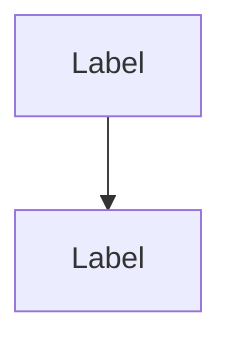

# Architecture Diagram Maintenance Guide

This guide explains how to maintain and update the architectural diagram in the README.md.

## Overview

The architecture diagram is located in `README.md` under the "🏗️ Architecture" section. It uses [Mermaid](https://mermaid.js.org/) syntax, which GitHub renders automatically.

## When to Update

Update the diagram when:

1. **Adding new components**: New services, handlers, or modules
2. **Changing data flows**: Modified communication patterns or APIs
3. **Adding integrations**: New external services or APIs
4. **Removing components**: Deprecated or removed functionality
5. **Major refactoring**: Significant architectural changes

## Diagram Structure

The diagram is organized into logical layers:

### 1. Client Layer
- Web UI (browser-based interface)
- Mobile App (future planned feature)

### 2. Application Layer
- FastAPI Server (main API)
- MQTT Event Handler (real-time event processing)
- Icon Service (image management for Yoto Mini displays)

### 3. Core Services
- Audio Manager (upload, conversion, streaming)
- Script Engine (CYOA interactive logic)
- Card Manager (MYO card management)

### 4. Data Layer
- Database (SQLite/PostgreSQL for metadata)
- File Storage (audio files and icons)

### 5. External Services
- Yoto REST API (yoto.dev)
- Yoto MQTT Broker (mqtt.yoto.io)

### 6. Yoto Devices
- Physical Yoto Players and Yoto Mini devices

## How to Update

### 1. Edit the Mermaid Code

The diagram uses Mermaid's `graph TB` (top-bottom) syntax. Basic structure:



### 2. Adding a New Component

To add a new component:

1. Decide which subgraph it belongs to
2. Add the node definition with a descriptive label
3. Add connections to/from related components
4. Optionally add a style for visual distinction

Example:
```mermaid
subgraph "Application Layer"
    NewService[New Service<br/>Description]
end

API --> NewService
NewService --> DB
```

### 3. Modifying Connections

Connection types:
- `-->` : Solid arrow (direct connection)
- `-.->` : Dashed arrow (future/optional connection)
- `<-->` : Bidirectional (two-way communication)
- `-->|Label|` : Arrow with label

Example:
```mermaid
API -->|REST Calls| YotoAPI
MQTT_Handler <-->|Real-time Events| YotoMQTT
```

### 4. Styling Nodes

Colors are defined at the bottom using the `style` keyword:

```mermaid
style NodeName fill:#e1f5ff
```

Current color scheme:
- Client Layer: `#e1f5ff` (light blue)
- Application Layer: `#fff3e0` (light orange)
- External Services: `#f3e5f5` (light purple)
- Yoto Devices: `#e8f5e9` (light green)
- Data Layer: `#fce4ec` (light pink)

## Testing Changes

### Local Preview

Use one of these tools to preview Mermaid diagrams locally:

1. **VS Code**: Install the "Markdown Preview Mermaid Support" extension
2. **Online Editor**: [Mermaid Live Editor](https://mermaid.live/)
3. **CLI Tool**: Install `@mermaid-js/mermaid-cli`

### GitHub Preview

GitHub automatically renders Mermaid diagrams in markdown files. Check the preview after committing:

1. Commit and push changes
2. View the README on GitHub
3. Verify the diagram renders correctly
4. Check that all connections and labels are visible

## Best Practices

### 1. Keep It High-Level
- Focus on major components and data flows
- Don't include implementation details
- Show logical groupings using subgraphs

### 2. Use Descriptive Labels
- Component name + brief description
- Use `<br/>` for line breaks in labels
- Keep labels concise but informative

### 3. Maintain Visual Clarity
- Group related components in subgraphs
- Use consistent arrow styles
- Add labels to connections for clarity
- Keep the layout clean and organized

### 4. Update Documentation Together
- When updating the diagram, also update:
  - `docs/ARCHITECTURE.md` for detailed explanations
  - Component-specific documentation
  - API documentation if interfaces change

### 5. Version Control
- Include diagram updates in the same PR as code changes
- Mention diagram updates in commit messages
- Document significant architectural changes in PR descriptions

## Common Tasks

### Adding a Database

```mermaid
DB[(Database Name<br/>Description)]
Component --> DB
style DB fill:#fce4ec
```

### Adding an External API

```mermaid
subgraph "External Services"
    NewAPI[New API<br/>api.example.com]
end

API -->|HTTP Requests| NewAPI
style NewAPI fill:#f3e5f5
```

### Adding a Background Worker

```mermaid
subgraph "Application Layer"
    Worker[Background Worker<br/>Async Tasks]
end

API --> Worker
Worker --> DB
style Worker fill:#fff3e0
```

### Marking Future Features

```mermaid
FutureFeature[Feature Name<br/><i>future</i>]
Component -.->|Planned| FutureFeature
```

## Troubleshooting

### Diagram Not Rendering

1. Check Mermaid syntax is valid (use [Mermaid Live](https://mermaid.live/))
2. Ensure code block is marked with ` ```mermaid `
3. Check for unescaped special characters
4. Verify all node names are consistent

### Layout Issues

1. Try different graph directions: `TB` (top-bottom), `LR` (left-right)
2. Reorder node definitions
3. Simplify complex subgraphs
4. Use line breaks in long labels

### Styling Not Applied

1. Verify node names match exactly (case-sensitive)
2. Check style definitions are at the end
3. Use valid CSS color codes
4. Test styles in Mermaid Live Editor

## Resources

- [Mermaid Documentation](https://mermaid.js.org/intro/)
- [Mermaid Flowchart Syntax](https://mermaid.js.org/syntax/flowchart.html)
- [GitHub Mermaid Support](https://github.blog/2022-02-14-include-diagrams-markdown-files-mermaid/)
- [Mermaid Live Editor](https://mermaid.live/)

## Questions?

If you have questions about updating the architecture diagram:
1. Check the [Architecture Documentation](ARCHITECTURE.md)
2. Open a [GitHub Discussion](https://github.com/earchibald/yoto-smart-stream/discussions)
3. Review previous PRs that modified the diagram
