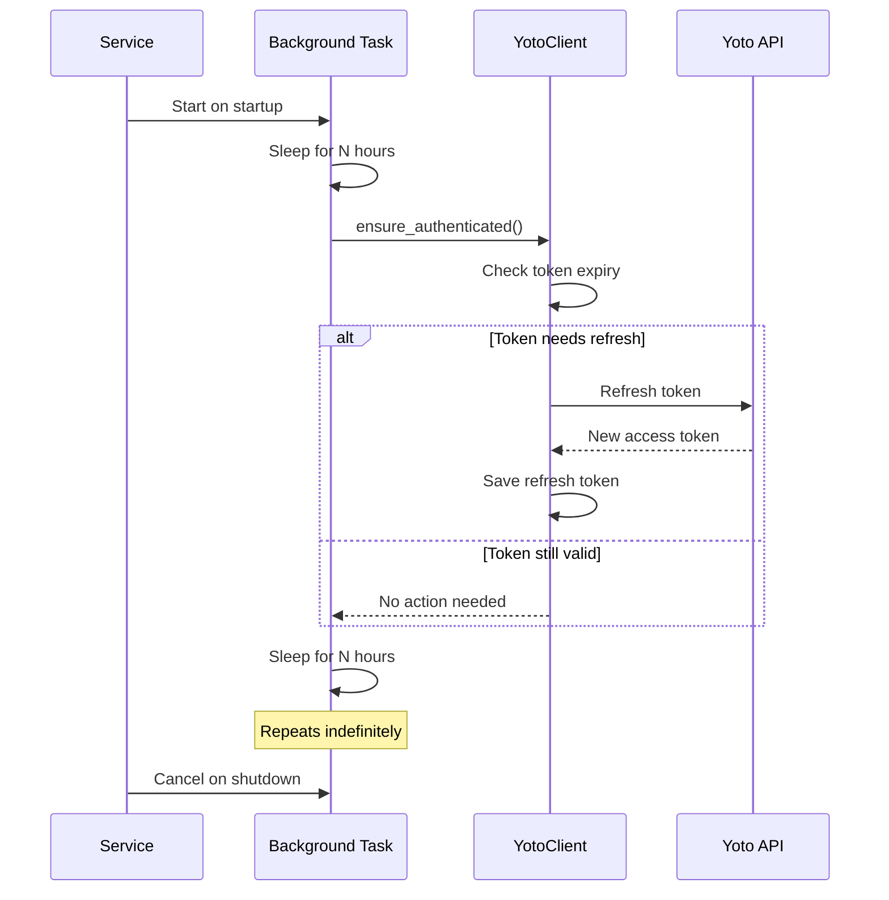

> **⚠️ DEPRECATED**: This documentation has been consolidated into the [yoto-smart-stream skill](../.github/skills/yoto-smart-stream/SKILL.md). Please refer to the skill for current information.
>
> **New location:** `.github/skills/yoto-smart-stream/reference/token_persistence.md`

---

# OAuth Token Persistence - Implementation Guide

## Problem Statement

OAuth authorizations were persisting, but tokens had a fairly short life. The goal was to extend the token lifetime to last much longer without requiring manual re-authentication.

## Root Cause

The Yoto API uses OAuth2 with:
- **Access tokens** that expire in 24 hours
- **Refresh tokens** that can be used to obtain new access tokens

The original implementation only refreshed tokens when API calls were made. During idle periods:
1. Access tokens would expire after 24 hours
2. If no API calls were made, tokens wouldn't be refreshed
3. Refresh tokens could potentially expire if not used for extended periods
4. Manual re-authentication would be required

## Solution

Implemented a background task that automatically refreshes OAuth tokens at regular intervals, ensuring tokens remain valid even during idle periods.

### Key Features

1. **Background Token Refresh Task**
   - Runs continuously in the background
   - Refreshes tokens every 12 hours by default (configurable)
   - Well before the 24-hour token expiry
   - Gracefully handles errors and continues running

2. **Configurable Interval**
   - `TOKEN_REFRESH_INTERVAL_HOURS` environment variable
   - Range: 1-23 hours (must be less than token expiry)
   - Default: 12 hours (safe middle ground)

3. **Automatic Lifecycle Management**
   - Starts automatically when service starts
   - Runs as async background task
   - Properly cancelled on shutdown
   - No manual intervention required

## Configuration

Add to your `.env` file or environment variables:

```bash
# Hours between automatic OAuth token refresh (1-23, default: 12)
TOKEN_REFRESH_INTERVAL_HOURS=12
```

### Recommended Settings

- **Production**: 12 hours (default) - Safe and conservative
- **Development**: 12 hours (default) - Same as production
- **High Traffic**: 6-8 hours - More frequent refresh for active systems
- **Low Traffic**: 12-16 hours - Less frequent for idle systems

⚠️ **Important**: Never set above 20 hours as tokens expire in 24 hours. Always leave a safety margin.

## How It Works



## Implementation Details

### 1. Background Task (`yoto_smart_stream/api/app.py`)

```python
async def periodic_token_refresh(yoto_client: YotoClient, interval_hours: int = 12):
    """
    Periodically refresh OAuth tokens to prevent expiration.
    
    Access tokens expire in 24 hours. This task refreshes them every 12 hours
    to ensure tokens remain valid even during idle periods.
    """
    interval_seconds = interval_hours * 3600
    
    while True:
        try:
            await asyncio.sleep(interval_seconds)
            
            if yoto_client and yoto_client.is_authenticated():
                yoto_client.ensure_authenticated()
                
        except asyncio.CancelledError:
            break
        except Exception as e:
            # Log error and continue running
            logger.error(f"Token refresh failed: {e}")
```

### 2. Lifecycle Integration

The background task is started in the FastAPI lifespan manager:

```python
@asynccontextmanager
async def lifespan(app: FastAPI):
    # Startup
    yoto_client = YotoClient(settings)
    yoto_client.authenticate()
    
    # Start background refresh
    refresh_task = asyncio.create_task(
        periodic_token_refresh(yoto_client, settings.token_refresh_interval_hours)
    )
    
    yield  # Application runs
    
    # Shutdown
    refresh_task.cancel()
    await refresh_task
```

## Logging

The implementation provides detailed logging:

```
INFO - Starting background token refresh task (every 12 hours)
INFO - Performing scheduled token refresh...
INFO - ✓ Token refresh successful
```

Or in case of errors:

```
ERROR - ✗ Token refresh failed: Refresh token invalid
ERROR -   Tokens may expire if not refreshed manually
```

## Testing

Comprehensive test suite in `tests/test_token_refresh.py`:

- ✅ Test successful token refresh
- ✅ Test error handling
- ✅ Test skipping when not authenticated
- ✅ Test interval timing
- ✅ Test graceful cancellation

Run tests:
```bash
pytest tests/test_token_refresh.py -v
```

## Benefits

1. **No Manual Re-authentication**
   - Tokens stay valid indefinitely
   - Service can run unattended
   - No user intervention required

2. **Handles Idle Periods**
   - Tokens refreshed even with no API calls
   - Prevents authentication failures
   - Reliable 24/7 operation

3. **Graceful Error Handling**
   - Continues running if refresh fails
   - Logs errors for troubleshooting
   - Automatic retry on next cycle

4. **Production Ready**
   - Minimal resource usage
   - Configurable for different needs
   - Proper cleanup on shutdown

## Troubleshooting

### Tokens Still Expiring

1. Check the refresh interval is set correctly
2. Verify the refresh token file exists and is valid
3. Check logs for refresh failures
4. Ensure `YOTO_CLIENT_ID` is configured

### Background Task Not Running

1. Check service startup logs for "Starting background token refresh task"
2. Verify no errors during authentication at startup
3. Ensure MQTT connection isn't blocking startup

### High Resource Usage

If refresh is too frequent:
1. Increase `TOKEN_REFRESH_INTERVAL_HOURS` (e.g., 16 hours)
2. Monitor logs to ensure it's not failing and retrying
3. Check for other background processes

## Migration Guide

### Existing Deployments

No code changes needed! Just set the environment variable:

```bash
TOKEN_REFRESH_INTERVAL_HOURS=12
```

The service will automatically start the background refresh task.

### Rollback

If needed, remove the environment variable. The service will continue working but tokens won't be refreshed automatically during idle periods.

## Security Considerations

1. **Refresh Token Storage**
   - Stored in file at `YOTO_REFRESH_TOKEN_FILE`
   - Default: `.yoto_refresh_token`
   - Railway: `/data/.yoto_refresh_token` (persistent volume)
   - Keep file permissions restricted

2. **Token Rotation**
   - New refresh tokens saved after each refresh
   - Old tokens automatically replaced
   - No token reuse issues

3. **Logging**
   - Never logs actual token values
   - Only logs refresh success/failure
   - Safe for production logging

## Future Enhancements

Potential improvements:
- Exponential backoff on refresh failures
- Metrics/monitoring for token refresh
- Alert on consecutive failures
- Token expiry notifications
